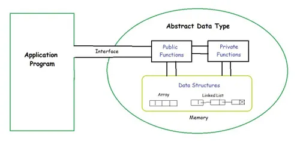
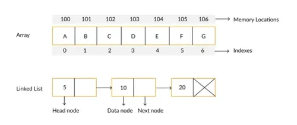

<!--Click ctrl+shitf+P and type and select preview to view the output of the md file.-->

# Algorithms

## Atomic Data
Data that consists of a single piece of info. It can't be divided into other meaningful pieces of data. A.k.a.scalar data

## Composite Data
Data that can be broken down into subfields that have meaning. E.g.: A telephone number is made up of the area code and then code for your address. Therefore, this data can be broken down into subfields with meanings.

## Data Types
An aggregation of atomic and composite data into a set with defined relationships. 
 |Array|Record|
 |---|---|
 |Homogenous sequence of data|Heterogeneous sequence of data|
 |Position association|No association|

## Abstract Data Types (ADT)
For many processes, programmers had to write the same code over and over again. To overcome this problem, they wrote the code in a file and turned it into a library for other programmers to use. For example, in python for file I/O functions, the ADT would be file. functions.  
The model for it is:  



### Implementations
1. Arrays
2. Linked List

### Arrays:
Arrays are a sequence with a fixed size. In most languages, they have a fixed size but they are expandable in python.

### Linked List
It is a collection of data in which each element contains the location of the next element or elements. Each element has 2 parts: **data** and **links**. Data is easily inserted or deleted. But, we are limited to sequential searches as the elements are no longer physically sequenced.  



## Point to Void
```C
#include<stdio.h>
#include<stdlib.h>

int main(){
    //local definitions
    void* p;
    int i = 7;
    float f = 23.5;

    //statements
    p = &i;
    printf("i contains: %d\n", *((int*)p));

    p = &f;
    printf("f contains: %f\n", *((float*)p));

    
    return 0;
}
```
####  Output:
```
  
i contains 7  
f contains 23.500000
```
